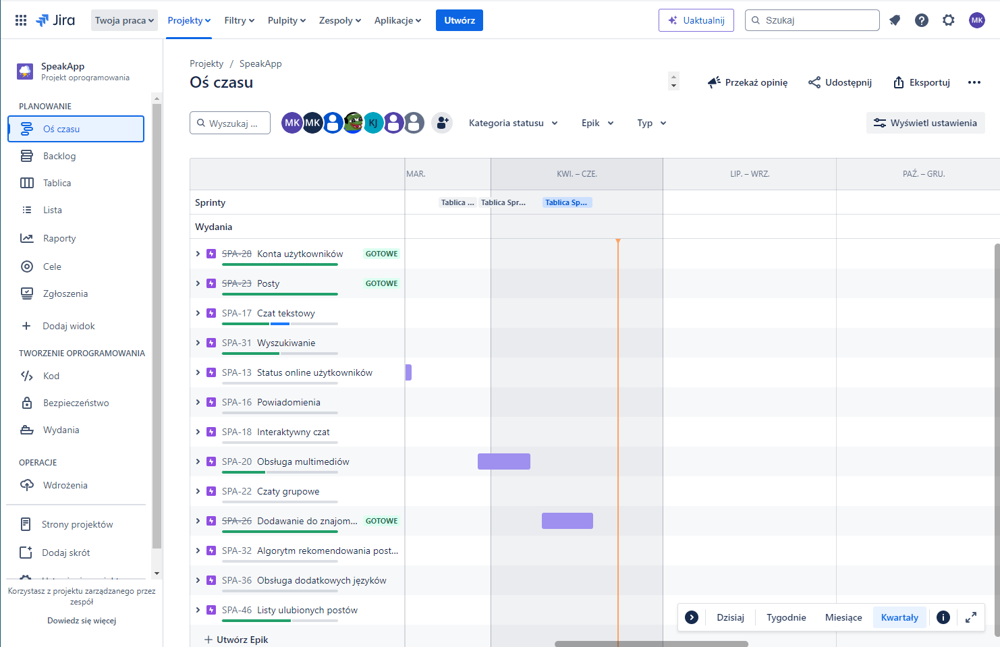

# Speak App

This project is a comprehensive social media web application designed to enable users to connect, share, and interact with each other in a dynamic and engaging environment. The application includes a variety of features to facilitate user interaction, content sharing, and real-time communication. Below are the key functionalities of the application: 

### User Posts 
<ul>
    <li><strong>Create Posts: </strong>Users can create new posts by uploading text and images.</li>
    <li><strong>Edit Posts: </strong>Users have the ability to edit their posts to correct or update information.</li>
    <li><strong>Delete Posts: </strong>Users can delete their posts if they no longer wish to share them.</li>
    <li><strong>Favorite Posts: </strong>Users can add posts to their favorites for easy access later.</li>
    <li><strong>Reactions:  </strong>Users can add reactions to posts, expressing their emotions or thoughts with likes, loves, and other emoji reactions.</li>
</ul>

### Comments
<ul> 
    <li><strong>Add Comments: </strong>Users can add comments to posts to engage in discussions.</li>
    <li><strong>Edit Comments: </strong>Users can edit their comments to correct or update information.</li>
    <li><strong>Delete Comments: </strong>Users can delete their comments if they no longer wish to share them.</li>
    <li><strong>Reactions: </strong>Users can add reactions to comments, similar to posts.</li>
</ul>

### Friendships
<ul> 
    <li><strong>Send Friend Requests: </strong>Users can send friend requests to other users to connect.</li>
    <li><strong>Accept/Decline Requests: </strong>Users can accept or decline friend requests.</li>
    <li><strong>View Friend List</strong>Users can view a list of their friends and manage connections.</li>
</ul>

### User Authentication
<ul>
    <li><strong>Sign up: </strong>New users can create an account by providing necessary details such as email, username, and password.</li>
    <li><strong>Login: </strong>Users can log in using their credentials to access the application.</li>
    <li><strong>JWT-Based Security: </strong>Secure authentication and session management using JSON Web Tokens (JWT).</li>
</ul>

### Real-Time Chat
<ul>
    <li><strong>Text Chat: </strong>Users can engage in real-time text chat with their friends.</li>
    <li><strong>Chat History: </strong>Users can view their chat history with friends.</li>
</ul>

### Profile Management
<ul>
    <li><strong>User Profiles: </strong>Users can create and update their profiles with personal information, profile pictures, and cover photos.</li>
</ul>

# Technologies
### Frontend (My Part)
<ul>
    <li><strong>Angular:</strong> A powerful framework for building the frontend of the application, providing a robust structure for developing dynamic and responsive user interfaces.</li>
    <li><strong>TypeScript:</strong> A superset of JavaScript that adds static typing, enabling the development of scalable and maintainable code.</li>
    <li><strong>WebSocket:</strong> A protocol used to implement real-time chat functionality, ensuring seamless and instant communication between users.</li>
</ul>

### Backend
<ul>
    <li><strong>Java Spring Boot:</strong> A framework for building the backend API, providing a comprehensive programming and configuration model for modern Java-based enterprise applications.</li>
    <li><strong>Microservices:</strong> An architectural style that structures the backend as a collection of loosely coupled services, enhancing scalability and maintainability.</li>
    <li><strong>Docker:</strong> A platform used for containerizing the application, ensuring consistency across multiple environments and simplifying the deployment process.</li>
    <li><strong>PostgreSQL:</strong> An advanced, open-source relational database used for storing and managing application data.</li>
</ul>

# Development and Team Collaboration

This was a team project, and my role focused on frontend development using Angular and TypeScript. The project was managed using Jira for task tracking and progress monitoring. Our development process followed Agile methodologies, working in sprints to ensure regular delivery of features and improvements. Our codebase was hosted on GitHub, where we followed a structured workflow:

<ul>
    <li><strong>Pull Requests: </strong>Team members created pull requests for new features and bug fixes.</li>
    <li><strong>Code Reviews: </strong>Each pull request underwent a code review process to ensure code quality and consistency.</li>
    <li><strong>Merging: </strong>After approval, pull requests were merged into the main branch.</li>
</ul>

<strong>Link to original repository: </strong>https://github.com/Project-SpeakApp/SpeakApp

### Jira Backlog

### Jira Timeline

### Pull Request

# Tasks done by me
<ul>
    <li>[Feature] As a user, I want to add a post.</li>
    <li>[Feature] As a user, I want to edit my post.</li>
    <li>[Feature] As a user, I want to delete my post.</li>
    <li>[Feature] As a user, I want to see posts (infinity scroll).</li>
    <li>[Feature] As a user, I want to see comments.</li>
    <li>[Feature] As a user, I want to sort comments by date and reactions.</li>
    <li>[Feature] As a user, I want to add a comment.</li>
    <li>[Feature] As a user, I want to edit my comment.</li>
    <li>[Feature] As a user, I want to delete my comment.</li>
    <li>[Bug] Shifting content when modal open.</li>
</ul>

# Screenshots

### Main Page

Thanks to infinity scroll users can load as much posts as they want.

### Post and Comment Edition

<table>
  <tr>
    <td></td>
    <td></td>
  </tr>
</table>

### Post and Comment Deletion

<table>
  <tr>
    <td></td>
    <td></td>
  </tr>
</table>

### List of Comments

Initially there are 2 comments and every time user clicks load more comments there will be up to 10 additional comments loaded.

<table>
  <tr>
    <td></td>
    <td></td>
  </tr>
</table>

### Real Time Chat
